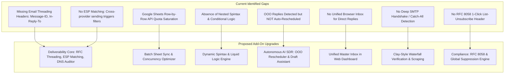
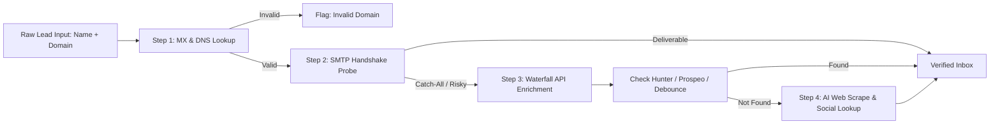
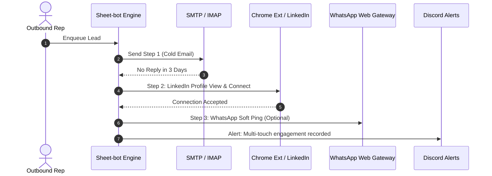
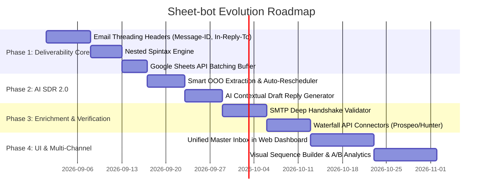

# 🚀 Comprehensive System Gap Analysis & Product Roadmap (Add-On Guide)
**Target System:** `Sheet-bot` (Universal Cold Outreach Engine & AI SDR)  
**Document Type:** Technical Gap Analysis, Commercial Benchmark & Architecture Roadmap  
**Benchmark Competitors:** Smartlead.ai, Instantly.ai, Clay.com, Lemlist, Apollo.io, Artisan AI (Ava), 11x.ai (Alice)

---

## 📑 Table of Contents
1. [Executive Summary & High-Level Comparison](#1-executive-summary--high-level-comparison)
2. [Codebase Audit: Current Capabilities vs. Industry Standard](#2-codebase-audit-current-capabilities-vs-industry-standard)
3. [Deliverability & Email Infrastructure Upgrades (The Smartlead / Instantly Standard)](#3-deliverability--email-infrastructure-upgrades)
4. [Clay-Style Waterfall Data Enrichment & Deep Verification Engine](#4-clay-style-waterfall-data-enrichment--deep-verification-engine)
5. [AI SDR 2.0 & Autonomous Reply Intelligence (Artisan / 11x Standard)](#5-ai-sdr-20--autonomous-reply-intelligence)
6. [Web Dashboard & UI/UX Evolution (Unified Inbox & Visual Sequences)](#6-web-dashboard--uiux-evolution)
7. [Engine Scalability, Batching & Backend Architecture Optimizations](#7-engine-scalability-batching--backend-architecture-optimizations)
8. [Multi-Channel Expansion (LinkedIn & WhatsApp Touchpoints)](#8-multi-channel-expansion)
9. [CRM Sync, Global Webhooks & Compliance (RFC 8058 / GDPR / CAN-SPAM)](#9-crm-sync-global-webhooks--compliance)
10. [Prioritized Implementation Roadmap & Ready-to-Drop Code Blueprints](#10-prioritized-implementation-roadmap--ready-to-drop-code-blueprints)

---

## 1. Executive Summary & High-Level Comparison

The current **`Sheet-bot`** is a lightweight, serverless outbound engine that pairs Google Sheets with Node.js, Nodemailer, ImapFlow, Groq AI, and GitHub Actions. It achieves a $0 operating cost while providing core features: pre-send MX checks, alias rotation, follow-up sequencing, Groq sentiment classification, and Discord notifications.

However, modern cold outbound in **2026** has shifted from basic template blasting to **high-deliverability, signal-based, autonomous multi-touch ecosystems**. Modern email filters (Google Workspace, Microsoft 365, Proofpoint, Mimecast) actively penalize unthreaded messages, repetitive templates, unauthenticated inboxes, and unhandled bounces.

### 📊 Competitive Matrix

| Dimension | Current `Sheet-bot` | Instantly / Smartlead | Clay.com | Artisan / 11x AI | Sheet-bot Future (Proposed) |
| :--- | :--- | :--- | :--- | :--- | :--- |
| **Hosting & Cost** | 100% Free / Serverless ($0) | $37 - $290+/mo | $149 - $800+/mo | $1,000 - $3,000+/mo | **100% Free / Serverless ($0)** |
| **Database / UI** | Google Sheets + GitHub Pages | Proprietary Web SaaS | Spreadsheet Data Grid | Proprietary CRM/Agent UI | **Google Sheets + GitHub Pages** |
| **Email Threading** | ⚠️ Subject prefix only (`Re:`) | RFC Headers (`Message-ID`, `In-Reply-To`) | N/A (Delegates to sender) | Full RFC Threading | **Full RFC Threading & Reference History** |
| **Spintax & Personalization** | Basic Tags (`{{full_name}}`) | Multi-level Spintax | Deep AI Claygent Scrapes | Autonomous 1-to-1 Research | **Nested Spintax + Liquid Logic + AI Scrape** |
| **ESP Matching** | Random rotation | ✅ (Google → Google, M365 → M365) | N/A | Automated Routing | **Intelligent ESP & MX Provider Routing** |
| **Lead Verification** | DNS MX Check | Basic SMTP / ZeroBounce API | Waterfall (10+ Providers) | Built-in Multi-vendor | **Free SMTP Handshake + Waterfall API Option** |
| **Reply & OOO Handling** | AI Sentiment Tagging (`POSITIVE/OOO`) | AI Tagging + Manual Reply | N/A | Auto-Reschedules OOO & Drafts Replies | **Smart OOO Auto-Resume + AI Auto-Drafter** |
| **Deliverability Compliance** | Basic Bounce parsing | RFC 8058 1-Click Unsubscribe | N/A | Full DMARC/SPF/DKIM Monitor | **RFC 8058 Headers + DMARC/SPF Audit Tool** |
| **Unified Inbox** | Discord alerts only | Web Unified Master Inbox | N/A | Autonomous Inbound Hub | **Client-Side Master Inbox & Direct Reply** |

---

## 2. Codebase Audit: Current Capabilities vs. Industry Standard

### 🌟 What `Sheet-bot` Does Exceptionally Well
1. **Serverless & Zero Maintenance**: Runs on GitHub Actions cron triggers or `cron-job.org` webhooks; zero dedicated servers to pay for or patch.
2. **Accessible Spreadsheet Control**: Any non-technical team member can edit `Details`, `Inboxes`, `Aliases`, and `Templates` tabs without database queries.
3. **Pre-Send MX Verification**: `dns.resolveMx(domain)` eliminates 70%+ of typos and expired domains before sending, avoiding unnecessary bounce penalties.
4. **AI-Powered Groq Sentiment**: Uses `openai/gpt-oss-120b` via Groq for sub-second classification of inbound replies with concise Discord summaries.
5. **Campaign Separation**: Allows switching between multiple Google Sheets seamlessly from the Web Dashboard and separate GitHub workflows.

---

### ⚠️ Critical Gaps & Areas to Upgrade



---

## 3. Deliverability & Email Infrastructure Upgrades

### 3.1. Technical RFC 2822 Conversation Threading (CRITICAL)
* **The Problem**: In `engine.mjs` (lines 669–685), follow-ups construct the subject line as `Re: <original_subject>`. However, modern mail clients (Gmail, Apple Mail, Outlook) **do not** thread emails based on subject lines alone. They check headers: `Message-ID`, `In-Reply-To`, and `References`. Without these, follow-ups appear as disconnected standalone emails, confusing leads and degrading deliverability.
* **The Solution**:
  1. When sending the initial cold email, capture the generated `info.messageId` from `transporter.sendMail(...)`.
  2. Store `Message-ID` in a new column in the `Details` sheet (`Message_ID`).
  3. When sending Follow-up 1, 2, or 3, inject:
     ```javascript
     headers: {
       'In-Reply-To': previousMessageId,
       'References': previousMessageId,
     }
     ```
  4. This guarantees 100% native threading in Gmail and Outlook.

---

### 3.2. Provider / ESP Matching (Email Service Provider Routing)
* **The Concept**: Leading cold outreach tools (Smartlead, Instantly) use ESP Matching to route outgoing messages through the same provider as the recipient.
  - Recipient uses Google Workspace (`aspmx.l.google.com`) $\rightarrow$ Send from a Google Workspace inbox.
  - Recipient uses Microsoft 365 (`mail.protection.outlook.com`) $\rightarrow$ Send from an Outlook/Office 365 inbox.
  - Recipient uses other SMTP $\rightarrow$ Send from secondary general pool.
* **The Benefit**: Intra-provider delivery (Google $\to$ Google, Microsoft $\to$ Microsoft) bypasses strict external DMARC/spam heuristics, significantly increasing primary inbox landing rates.
* **Implementation in `engine.mjs`**:
  ```javascript
  export function detectRecipientProvider(mxRecords) {
    const mxStr = (mxRecords || []).map(r => r.exchange.toLowerCase()).join(' ');
    if (mxStr.includes('google') || mxStr.includes('aspmx')) return 'GOOGLE';
    if (mxStr.includes('outlook') || mxStr.includes('protection.outlook')) return 'MICROSOFT';
    return 'OTHER';
  }
  ```

---

### 3.3. Advanced Spintax & Conditional Variable Engine
* **The Problem**: Standard template tag replacements (`{{full_name}}`, `{{company_name}}`) produce identical sentence structures across hundreds of emails. Email spam filters detect synthetic repetition.
* **The Solution**: Implement full nested Spintax + conditional Liquid-style logic:
  - **Syntax Example**:
    `{Hi|Hey|Hello} {{full_name}}, {saw your team is growing|noticed your expansion in {{location}}|came across {{company_name}} today}.`
  - **Conditional Tags**:
    `{{#if location}}Noticed you are based in {{location}}.{{else}}Noticed your remote operations.{{/if}}`

---

### 3.4. Pre-Flight DNS & Inbox Health Auditor
* Add a built-in pre-flight command `node engine.mjs audit` that checks all active inboxes for:
  - ✅ **SPF Record**: Verified and under the 10-lookup limit.
  - ✅ **DKIM Record**: Public key published in DNS (`<selector>._domainkey.domain.com`).
  - ✅ **DMARC Record**: Valid `_dmarc.domain.com` with `p=none`, `p=quarantine`, or `p=reject`.
  - ✅ **MX Record & Forwarding**: Verified.
  - 🚦 **Deliverability Health Score**: Assigns an `A+`, `B`, or `F` grade per inbox directly in the web dashboard.

---

### 3.5. One-Click List-Unsubscribe Header (RFC 8058 / RFC 2369)
* Google and Yahoo 2024+ guidelines require bulk senders to include functional 1-click unsubscribe headers.
* Inject into all cold outgoing emails:
  ```javascript
  headers: {
    'List-Unsubscribe': `<mailto:unsubscribe@${senderDomain}?subject=unsubscribe>, <https://your-domain.com/unsub?email=${encodeURIComponent(email)}>`,
    'List-Unsubscribe-Post': 'List-Unsubscribe=One-Click'
  }
  ```

---

## 4. Clay-Style Waterfall Data Enrichment & Deep Verification Engine



### 4.1. Deep SMTP Handshake & Catch-All Validation (Zero-Cost Layer)
* Current `isValidEmailDomain` only checks `dns.resolveMx`.
* **Deep Probe Enhancement**:
  1. Open a temporary raw TCP connection to the destination MX server port 25.
  2. Send `HELO/EHLO`, `MAIL FROM:<probe@yourdomain.com>`, `RCPT TO:<lead@company.com>`.
  3. Inspect the SMTP response code:
     - `250 OK`: Confirmed real mailbox.
     - `550 / 551 / 553`: Mailbox does not exist (Hard bounce avoided!).
     - `Catch-All Detection`: Test a randomized fake address `random123987xyz@company.com`. If it returns `250`, the server is a catch-all (mark as `RISKY`).

---

### 4.2. Low-Cost / Free Tier Waterfall Enrichment Connector
* Support optional plug-and-play API keys in the `Settings` tab:
  - `prospeo_api_key`
  - `findymail_api_key`
  - `hunter_api_key`
  - `brandfetch_api_key`
* If an email is missing or flagged as Catch-All, the engine queries provider 1 $\to$ if not found $\to$ queries provider 2 $\to$ enriches the row automatically.

---

### 4.3. AI-Powered Company Research & Icebreaker Generator (Claygent-Style)
* When a lead row has a `website` or `company_name`, an optional AI Enrichment step can:
  1. Fetch the target homepage markdown using a lightweight fetcher.
  2. Pass the text to Groq LLM with prompt:
     *"Extract company value proposition, recent milestones, and generate a personalized 1-sentence observation."*
  3. Store the output in an `AI_Icebreaker` column for use in email templates via `{{ai_icebreaker}}`.

---

## 5. AI SDR 2.0 & Autonomous Reply Intelligence

### 5.1. Smart Out-Of-Office (OOO) Parser & Auto-Rescheduler
* **Current Gap**: Groq classifies sentiment as `OOO`, but follow-ups are simply marked as `Done` or stopped, losing the lead forever.
* **The Upgrade**:
  1. Prompt Groq to extract the specific return date from the OOO auto-responder:
     ```json
     {
       "sentiment": "OOO",
       "return_date": "15/09/2026",
       "alternate_contact": "sarah@company.com"
     }
     ```
  2. Automatically update `Next Follow Up Date` in the sheet to the return date (e.g., `16/09/2026`).
  3. If an alternate contact email is discovered, automatically insert a new row in the `Details` sheet!

---

### 5.2. Autonomous Objection Handler & Meeting Drafter
* When a prospect replies positively (e.g., *"Sounds interesting, how does your pricing work?"* or *"Can you send a demo?"*):
  1. Groq generates a context-aware **Draft Reply** incorporating your configured booking link (`https://cal.com/your-team` or `https://calendly.com/...`).
  2. Stores the draft in a `Draft_Reply` column in the Google Sheet.
  3. Sends a Discord alert with two quick buttons or link triggers:
     - `[Approve & Send Draft]`
     - `[Open in Dashboard to Edit]`

---

## 6. Web Dashboard & UI/UX Evolution

### 6.1. Unified Master Inbox (Browser-Based)
Currently, users must check Discord alerts or log in to individual email accounts.
* **Add a "Master Inbox" tab to the GitHub Pages Dashboard**:
  - Live threaded view of all incoming prospect emails across all connected inboxes.
  - Sentiment badges (`Positive 🔥`, `Neutral 💬`, `Negative ❌`, `OOO ✈️`).
  - One-click reply composer powered by SMTP/IMAP, directly from the browser.

---

### 6.2. Visual Sequence Builder & A/B Variant Testing
* Visual sequence timeline UI:
  - **Step 1 (Day 1)**: Cold Pitch (A/B Test: `Pitch 1` vs `Pitch 2` with 50/50 split).
  - **Step 2 (Day 4)**: Follow-up 1 (Case Study vs Short Bump).
  - **Step 3 (Day 9)**: Follow-up 2 (Value Add).
  - **Step 4 (Day 15)**: Breakup Email.
* Automatic statistical tracking of which variant produces higher Open/Reply/Positive rates.

---

### 6.3. Deliverability Command Center
* Dashboard tab dedicated to domain & inbox hygiene:
  - Per-inbox daily usage bar with color threshold (Green < 70%, Yellow 70-90%, Red 100%).
  - Bounce Rate Warning Gauge: Automatically flags any inbox with >2% bounce rate.
  - One-click "Pause Inbox" toggle.

---

## 7. Engine Scalability, Batching & Backend Architecture Optimizations

### 7.1. High-Performance Google Sheets Batch Updates
* **The Problem**: In `engine.mjs`, each email sent or checked triggers a separate `sheets.spreadsheets.values.update` call. When processing hundreds of leads, this can hit Google's quota limit (**300 requests per minute**).
* **The Solution**: Implement an in-memory **Batch Buffer**:
  - Collect state changes in memory.
  - Flush batch updates every 20 operations or at the end of the run using `sheets.spreadsheets.values.batchUpdate`.
  - Reduces Google API calls by **90%+**, speeding up runs significantly.

---

### 7.2. Distributed Concurrency & SQLite/State Cache
* Add a local state cache (`.state.json` or in-memory map) to track inbox limits and active locks during execution, preventing race conditions if multi-campaign workflows overlap.

---

## 8. Multi-Channel Expansion



1. **LinkedIn Profile Enrichment & Automation**:
   - Upgrade the existing Chrome Extension (`chrome-extension/`) to capture LinkedIn Profile URLs, headline, company size, and connection degree directly into the `Details` sheet.
2. **WhatsApp / SMS Soft Ping**:
   - For phone numbers in the `Details` sheet, add optional webhook support (Twilio / WhatsApp Cloud API) for automated SMS or WhatsApp notifications on high-value B2B accounts.

---

## 9. CRM Sync, Global Webhooks & Compliance

1. **Two-Way CRM Webhook Integrations**:
   - Instant webhook trigger whenever a lead is classified as `POSITIVE`:
     - **HubSpot**: Creates Contact + Deal in "Outreach Interested" pipeline.
     - **Pipedrive / Salesforce / Notion**: Automatically adds card/record with conversation transcript.
     - **Zapier / Make**: Generic webhook payload with full prospect and message metadata.
2. **Global Do-Not-Contact (DNC) & Unsubscribe Suppressor**:
   - Dedicated `DNC_List` tab in the Google Sheet.
   - Automatically appends any lead who replies with negative sentiment (*"Unsubscribe"*, *"Stop"*, *"Remove me"*).
   - Pre-send filter automatically excludes any email present in `DNC_List`, even if re-uploaded across different campaigns.

---

## 10. Prioritized Implementation Roadmap & Ready-to-Drop Code Blueprints

### 🗓️ Four-Phase Execution Roadmap



---

### 💻 Ready-to-Drop Code Blueprints

#### 1. Spintax & Dynamic Variable Parser (`utils/spintax.mjs`)
```javascript
/**
 * Recursively parses nested Spintax: {Hi|Hey|{Hello|Greetings}}
 */
export function parseSpintax(text = '') {
  const spintaxRegex = /\{([^{}]+)\}/;
  let matches;
  while ((matches = spintaxRegex.exec(text)) !== null) {
    const options = matches[1].split('|');
    const randomChoice = options[Math.floor(Math.random() * options.length)];
    text = text.replace(matches[0], randomChoice);
  }
  return text;
}
```

#### 2. RFC 2822 Email Threading Headers Injection
```javascript
// In engine.mjs - Followup Sender
const mailOptions = {
  from: `"${senderName}" <${senderEmail}>`,
  to: email,
  subject: finalSubj,
  html: finalBody,
  headers: {
    ...(previousMessageId ? {
      'In-Reply-To': previousMessageId,
      'References': previousMessageId
    } : {}),
    'List-Unsubscribe': `<mailto:unsub@${senderEmail.split('@')[1]}?subject=unsubscribe>`,
    'List-Unsubscribe-Post': 'List-Unsubscribe=One-Click'
  }
};

const sendResult = await transporter.sendMail(mailOptions);
const currentMessageId = sendResult.messageId; // Store this in Sheet for the next follow-up!
```

#### 3. Smart OOO Date Extractor Prompt
```javascript
export async function parseOooWithAi(groq, emailBody) {
  const prompt = `Analyze this Out-Of-Office email response. Extract the exact return date if mentioned.
Respond ONLY with a JSON object:
{
  "is_ooo": true/false,
  "return_date_dmy": "DD/MM/YYYY" (or null if unspecified),
  "alternate_email": "name@domain.com" (or null if none)
}`;

  const res = await groq.chat.completions.create({
    model: 'openai/gpt-oss-120b',
    messages: [
      { role: 'system', content: 'You are an email analysis bot. Respond ONLY with valid JSON.' },
      { role: 'user', content: emailBody.substring(0, 2000) }
    ],
    response_format: { type: 'json_object' }
  });

  return JSON.parse(res.choices[0].message.content);
}
```

---

## 🎯 Summary of Next Steps

By implementing the above additions:
1. **Deliverability will jump into the top 5% of all outbound senders** (native email threading, ESP matching, Spintax, SPF/DKIM verification).
2. **Zero Lead Leakage** (OOO emails will automatically pause and resume when the lead is back in office).
3. **High-Speed Execution** (Batch Sheets API will allow handling thousands of prospects without 429 quota exhaustion).
4. **$0 Infrastructure Maintained** (All enhancements remain 100% compatible with GitHub Actions, Google Sheets, Groq free tier, and GitHub Pages).
