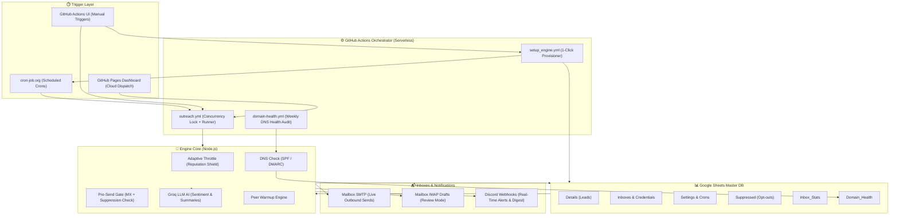
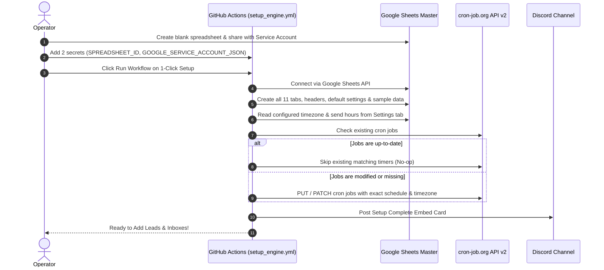
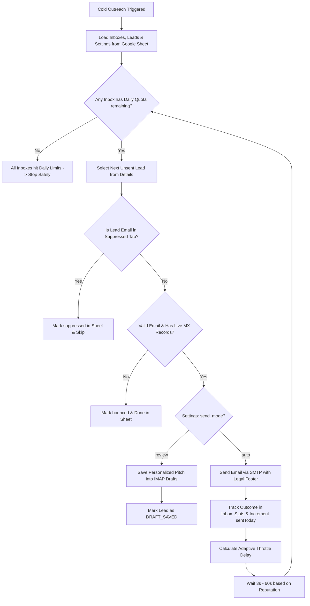
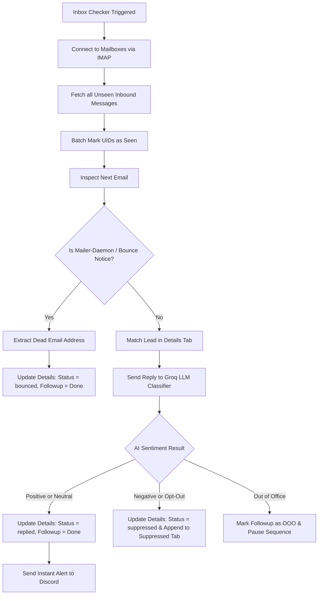
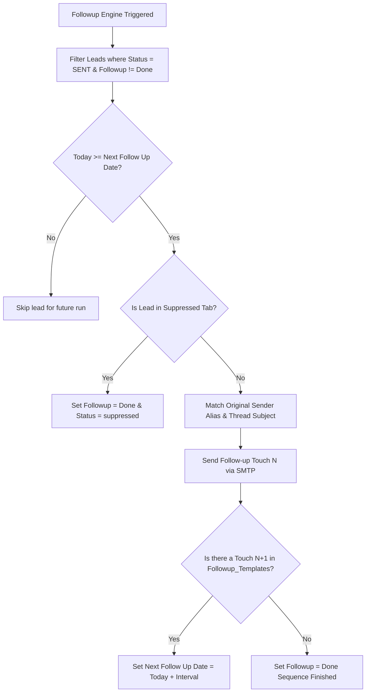
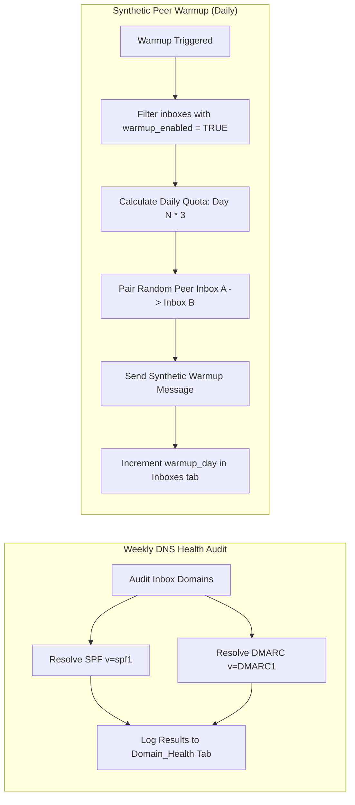

# 🏛️ System Architecture & Visual Implementation Guide

Sheet-bot is a serverless-ready, Google Sheets-native cold outreach, warmup, and follow-up engine designed to run via **GitHub Actions**, **cron-job.org**, or locally with **zero persistent database costs**.

---

## 🗺️ 1. End-to-End System Architecture

---

## ⚡ 2. 1-Click Zero-Effort Setup Sequence

---

## 📬 3. Cold Email Outreach Pipeline

---

## 🤖 4. 24/7 Inbox Monitoring & AI Reply Classification

---

## 🔁 5. Multi-Touch Follow-up Sequence Engine

---

## 🛡️ 6. Deliverability Protection & Peer Warmup

---

## 📦 7. Module Breakdown

1. **Orchestrator (`engine.mjs`)**: The core execution engine. Connects to Google Sheets, loads runtime configurations, runs reply-checking across inboxes, computes adaptive throttle delays, and handles touch scheduling.
2. **Adaptive Throttle (`src/throttle.mjs`)**: Monitors per-inbox health metrics (bounce rate, spam complaints, sent-today count) and dynamically slows down send velocity (from 3s steady state up to 60s) to protect sender reputation.
3. **Retry Wrapper (`src/retry.mjs`)**: Ensures all external network operations (Google Sheets API, SMTP transports, Groq LLM inferences) gracefully recover from transient network glitches using exponential backoff.
4. **Suppression & Compliance (`src/suppression.mjs`)**: Enforces CAN-SPAM and GDPR compliance by caching suppressed emails in-memory (5-min TTL), validating HMAC-signed unsubscribe tokens, and appending legal company footers.
5. **DNS & Deliverability (`src/dns-check.mjs`)**: Audits DNS TXT records for SPF (`v=spf1`) and DMARC (`v=DMARC1`) to guarantee mailbox authentication.
6. **Peer-to-Peer Warmup (`src/warmup.mjs`)**: Automatically sends synthetic warmup emails between configured inboxes to safely build and maintain domain reputation.
7. **Alerts & Telemetry (`src/alerts.mjs`)**: Transmits actionable diagnostic alerts to Discord when bounce rates exceed thresholds or workflows complete.
