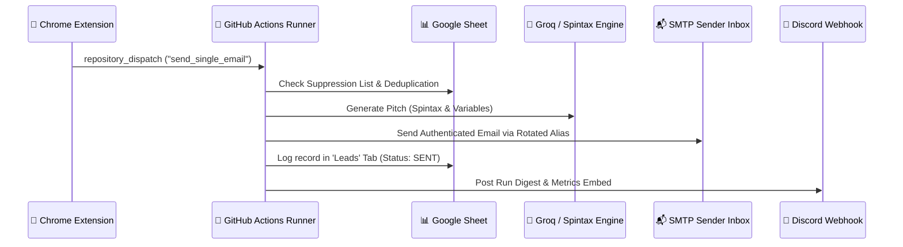

# 🚀 Sheet-Bot Chrome Extension — Complete User & Setup Guide

The **Sheet-Bot Chrome Extension** is a lightweight, Manifest V3 companion tool designed for instant, high-speed outreach dispatch directly from your browser. 

It allows you to prospect anywhere on the web, parse emails on the fly, and trigger personalized cold outreach via your **GitHub Actions & Google Sheets engine** without ever opening a spreadsheet or terminal.

---

## 📑 Table of Contents
1. [Key Capabilities](#-key-capabilities)
2. [60-Second Installation Guide](#-60-second-installation-guide)
3. [One-Time Configuration (GitHub PAT & Repo)](#-one-time-configuration-github-pat--repo)
4. [Multi-Campaign & Profile Management](#-multi-campaign--profile-management)
5. [How to Send Single Instant Outreach](#-how-to-send-single-instant-outreach)
6. [How to Dispatch Bulk Lead Batches](#-how-to-dispatch-bulk-lead-batches)
7. [What Happens Behind the Scenes](#-what-happens-behind-the-scenes)
8. [Troubleshooting & Common Errors](#-troubleshooting--common-errors)

---

## ⚡ Key Capabilities

* **🧠 Smart Auto-Parsing**:
  * **Name Extraction**: Converts `rohan.patel@hireologist.in` ➔ `Rohan`.
  * **Role-Based Fallback**: Auto-detects generic roles (`hr@`, `careers@`, `talent@`, `info@`, `sales@`, `support@`) ➔ `Team`.
  * **Company Extraction**: Cleans email domains (strips corporate suffixes like `technologies`, `solutions`, `group`, `ltd`, `consulting`) ➔ `Hireologist`.
  * **Public Provider Detection**: Normalizes `gmail.com`, `yahoo.com`, etc. ➔ `Your Company`.
* **📂 Multi-Campaign Switcher**: Switch between different client spreadsheets or campaign profiles in 1 click from the header dropdown.
* **🚀 Cloud Trigger via GitHub API**: Zero local mail software needed; sends encrypted dispatches to your GitHub runner with automated alias rotation, spintax rendering, and unsubscribe injection.
* **📊 Batch Progress Visualizer**: Paste 50+ emails and watch real-time progress tracks as they get queued.

---

## 📥 60-Second Installation Guide

The extension is included in the `chrome-extension/` directory of this repository:

1. Open **Google Chrome** (or Brave / Microsoft Edge).
2. Navigate to `chrome://extensions/` in your address bar.
3. In the top-right corner, toggle **Developer mode** to **ON** `[ ✔ ]`.
4. In the top-left corner, click **Load unpacked**.
5. Browse to your repository folder and select the `chrome-extension` directory:
   ```text
   d:\Codinf projets\Sheet-bot\chrome-extension
   ```
6. Click the **Puzzle icon** (🧩) on the Chrome toolbar and **Pin** (📌) **Sheet-Bot Remote Dispatcher**.

---

## ⚙️ One-Time Configuration (GitHub PAT & Repo)

Before your first send, connect the extension to your GitHub repository:

1. Click the **Sheet-Bot icon** in your Chrome toolbar.
2. Navigate to the **⚙️ Settings** tab.
3. Fill in the **GitHub API Connection** fields:
   * **GitHub PAT Token**: Your Personal Access Token (starts with `ghp_` or `github_pat_`).
   * **GitHub Repo Owner**: Your GitHub username or organization (e.g., `Rohanpatel16`).
   * **GitHub Repository Name**: Your repository name (e.g., `Sheet-bot`).
4. Click **💾 Save Credentials**.
5. Click **🔌 Test Connection** — you will see a green confirmation badge:
   ```text
   ✅ Connection Success! Token has access to repository "Rohanpatel16/Sheet-bot".
   ```

> [!TIP]
> **How to create a GitHub PAT Token:**
> 1. Go to [GitHub Token Settings](https://github.com/settings/tokens).
> 2. Generate a **Classic Token** with the `repo` scope checked, OR a **Fine-Grained Token** with `Contents: Read & write` and `Workflows: Read & write` permissions.

---

## 📂 Multi-Campaign & Profile Management

If you manage multiple outreach campaigns or different Google Sheets:

1. Open **⚙️ Settings** ➔ Scroll to **Multi-Campaign & Webhook Profiles**.
2. Enter your profile details:
   * **Campaign Profile Name**: e.g., `Hireologist Main Campaign` or `SaaS Founders`.
   * **Google Sheet ID**: The 44-character ID from your Google Sheet URL.
   * **Webhook URL Override** *(Optional)*: Leave blank to auto-use your Sheet's Discord webhook.
   * **Default Location Fallback**: e.g., `Mumbai` or `India`.
3. Click **➕ Save / Add Campaign Profile**.
4. Use the **Campaign Selector** at the top of the popup to switch active campaigns instantly!

---

## 👤 How to Send Single Instant Outreach

Use this whenever you are browsing LinkedIn, company websites, or directory listings and find a hot prospect:

```
┌──────────────────────────────────────────────────────────┐
│  Recipient Email:  [ rohan.patel@hireologist.in        ] │
│  Full Name:        [ Rohan                             ] │
│  Company Name:     [ Hireologist                       ] │
│  Location:         [ Mumbai                            ] │
│                                                          │
│  [  🚀 Send Instant Email  ]                             │
└──────────────────────────────────────────────────────────┘
```

1. Click the extension icon and select the **Single Email** tab.
2. Type or paste the prospect's email address into **Recipient Email**.
3. Watch the **Full Name** and **Company Name** automatically extract in real-time!
4. Customize the name, company, or location if you want a custom touch.
5. Click **🚀 Send Instant Email**.
6. The extension dispatches the lead directly to your GitHub cloud runner.

---

## 👥 How to Dispatch Bulk Lead Batches

Use this when you have a list of raw email addresses copied from an export, CSV, or message thread:

1. Click the extension icon and select the **Bulk Batch** tab.
2. Paste the list into the textarea (one email per line or comma-separated):
   ```text
   rohan.patel@hireologist.in
   hr@acme-technologies.com
   priya.sharma@fintechcorp.io
   ```
3. Click **✨ Parse List**.
4. An interactive table will display:
   * Formatted recipient emails.
   * Auto-extracted first names.
   * Cleaned company names.
5. Click **🚀 Dispatch Bulk Batch to GitHub**.
6. Watch the real-time progress bar track each email as it is dispatched to the engine.

---

## ⚙️ What Happens Behind the Scenes

When you click Send in the Chrome Extension:



1. **Safety Check**: Checks if the recipient is in your `Suppression` tab.
2. **Dynamic Unsubscribe**: Injects a personalized mailto unsubscribe footer targeting the sending alias with pre-filled body and subject.
3. **App Password Safeguards**: Verifies SMTP/IMAP credentials before sending.
4. **Google Sheet Sync**: Appends or updates the lead row in your `Leads` tab with timestamps, sender inbox, and status.

---

## 🛠️ Troubleshooting & Common Errors

| Error Message | Cause | How to Fix |
|---|---|---|
| `❌ GitHub Permission Error (403)` | PAT Token lacks workflow permissions. | Edit token on GitHub ➔ Grant `Contents: Read & write` and `Workflows: Read & write` (or check `repo` for classic tokens). |
| `❌ GitHub Authentication Error (401)` | Token is expired or mistyped. | Generate a fresh token at [github.com/settings/tokens](https://github.com/settings/tokens) and paste into Settings. |
| `❌ GitHub Repository Error (404)` | Owner or repo name mistyped. | Verify **Owner** (`Rohanpatel16`) and **Repo** (`Sheet-bot`) match your exact GitHub repository URL. |
| `⚠️ Extension Icons look blank / green` | Browser cache has not reloaded icons. | Go to `chrome://extensions` ➔ Click 🔄 **Reload** next to Sheet-Bot. |

---

### 📚 Related Documentation
* [10-Minute Setup Guide (`SETUP_10MIN.md`)](./SETUP_10MIN.md)
* [Google App Password Setup (`GOOGLE_APP_PASSWORD_SETUP.md`)](./GOOGLE_APP_PASSWORD_SETUP.md)
* [Cron Automation & Timing Sync (`CRON_SETUP.md`)](./CRON_SETUP.md)
* [Manual Testing & Diagnostic Playbook (`MANUAL_TESTING.md`)](./MANUAL_TESTING.md)
